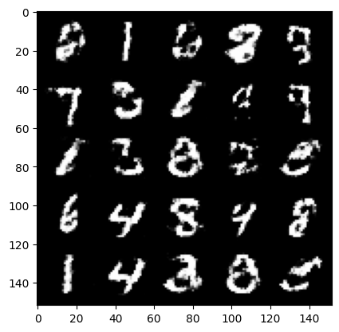
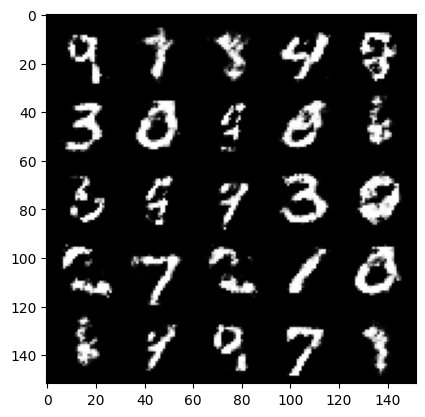
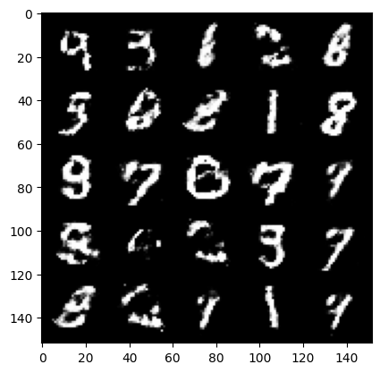
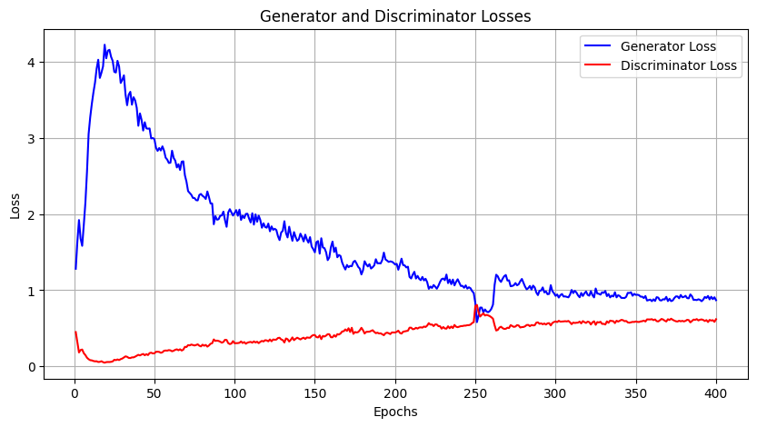

### Basic GAN Implementation Using FC Layers

## Output Images

## Loss Graph

| Model | Link |
| ------------- | ------------- |
| discriminator.pth | [Drive](https://drive.google.com/file/d/1pYSZiDDwxxoqjkAZZ-PECde5V4GIpN5U/view?usp=sharing) (2.2MB) |
| generator.pth | [Drive](https://drive.google.com/file/d/1ayB1Reb4-JkNQkH8_UO5HetbHJDD4td-/view?usp=sharing) (5.8MB) |