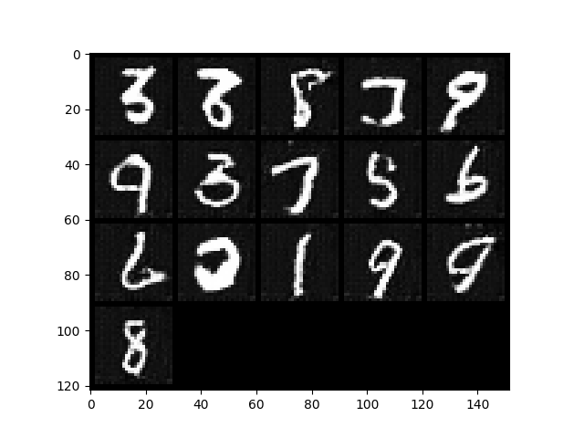
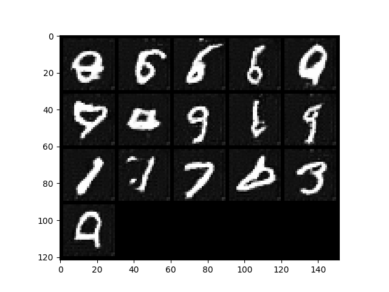
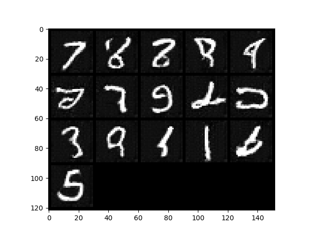

### DC GAN Implementation Using Convolutional Layers

## Output Images

## Loss Graph

- TBD

| Model | Link |
| ------------- | ------------- |
| discriminator.pth | [Drive](https://drive.google.com/file/d/1m-sRNbOWJiJQs4QzMmaAnu_sDkhMQjwz/view?usp=sharing) (45KB) |
| generator.pth | [Drive](https://drive.google.com/file/d/1h65bkLTUIcGggrikFo9JXuc3tVKCI0eC/view?usp=sharing) (3MB) |